# DDD기본개념 다지기

[참고 블로그](https://velog.io/@gowjr207/%EB%8F%84%EB%A9%94%EC%9D%B8-%EC%A3%BC%EB%8F%84-%EC%84%A4%EA%B3%84DDD%EB%A5%BC-%EC%84%A4%EB%AA%85%ED%95%B4%EB%B3%B4%EB%8B%A4)

## 1. DDD 주도 설계

### 1.1 도메인
- 도메인은 영역을 뜻함
- 비즈니상에서 도메인이란 업무의 집합
- ex)도메인은 작고 크게 나눌 수 있음.
  - 스타벅스는 커피 도메인
  - 버거킹은 음식 도메인
- 서브 도메인들이라고 구체적으로 나눌수 있지만 가장 큰틀의 도메인의 의미는 예시와 같음
 
- 한 IT기업이 업무를 하기 위해서는 회사의 업무에 관련한 도메인이 필요하다.
   
- ex) 현재 내 상황에 대한 예시
   - 회사 업무
   - 회사 솔루션
   - 회사에 앞으로 나아가야할 방향
 - 이 위의 모든 것이 회사에 관련한 도메인이라고 할 수 있다.
 
- 회사에서 도메인의 이해가 있다는 것
   - 사원으로서 내 할일이 아닌 회사가 활동하는 영역이 어떤 것인지
   - 회사가 지향하는 비즈니스가치가 무엇인지 파악이 된 상태
 

## 1.2 도메인 전문가와 개발자

- 개발자 입장에서 경력도 제 각각 다르고 지금까지 개발해온 환경도 다른 사람들이 모여서 협업을 하는데, 회사의 도메인에 대한 이해가 높낮이가 분명히 존재한다.
   
- 반대로 기획자의 입장에서 해당 서비스를 기획한 입장에서 도메인에 대한 이해가 적어도 개발자 보다 높다고 할 수 있다.
   
- 설계 할 내용에 도메인에 대한 이해가 높은 사람을 도메인 전문가라고 표현한다.
   

- DDD설계를 잘 하기 위해선 도메인 전문가와 소프트에어 엔지니어가 서로 기획부터 개발까지 이르는 길을 구체화 시키는 과정에 모두 참여하는 의미를 뜻한다.
- 소프트웨어 엔티티와 도메인 컨셉을 항상 함께 움직이는 구조의 모델로서 가능한 가까이 일치시키는것이다.

### 1.3 DDD설계의 기본과정
- 여러 방법 중 기본 과정
  - 이벤트 스토밍
  - 바운디드 컨텍스트
  - 컨텍스트 맵

#### 1.3.1 이벤트 스토밍

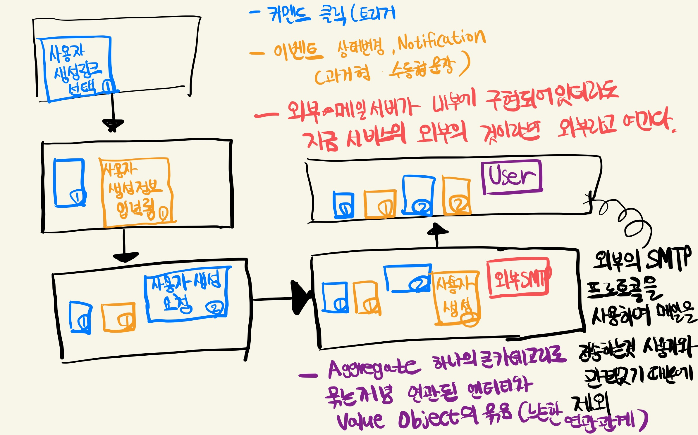

#### 1.3.2 Aggregate pattern

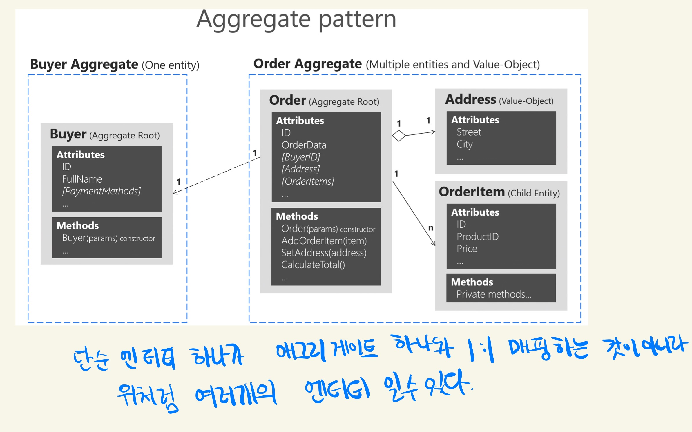

#### 1.3.3 바운디드 컨텍스트

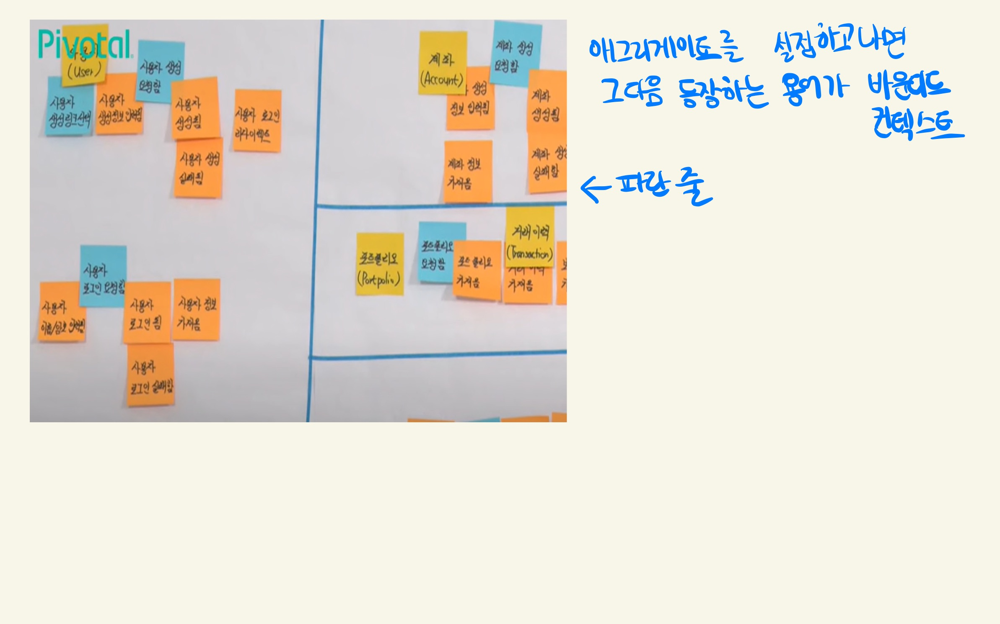

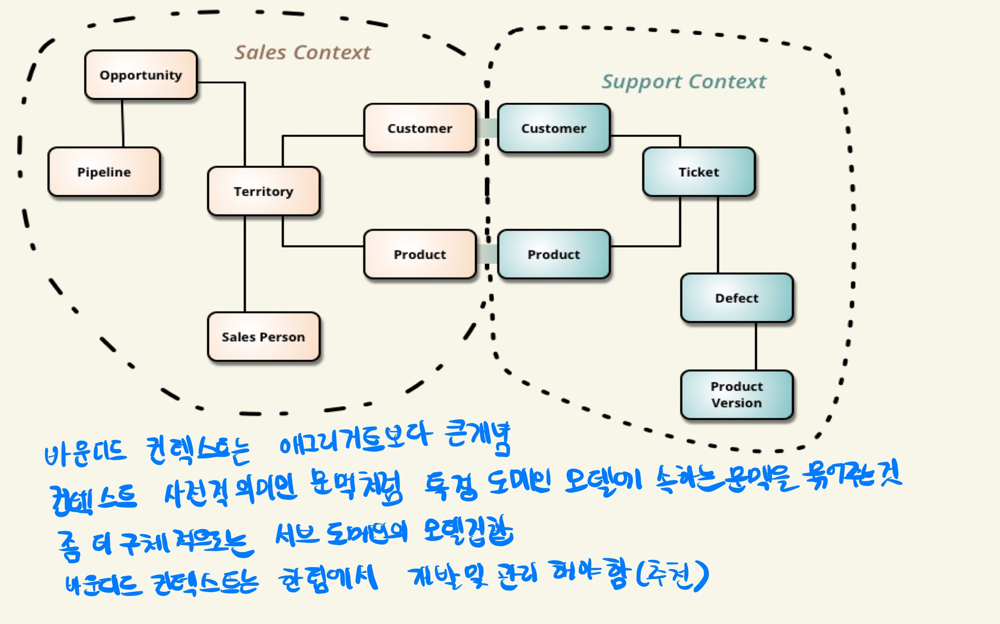

#### 1.3.4 컨텍스트 맵
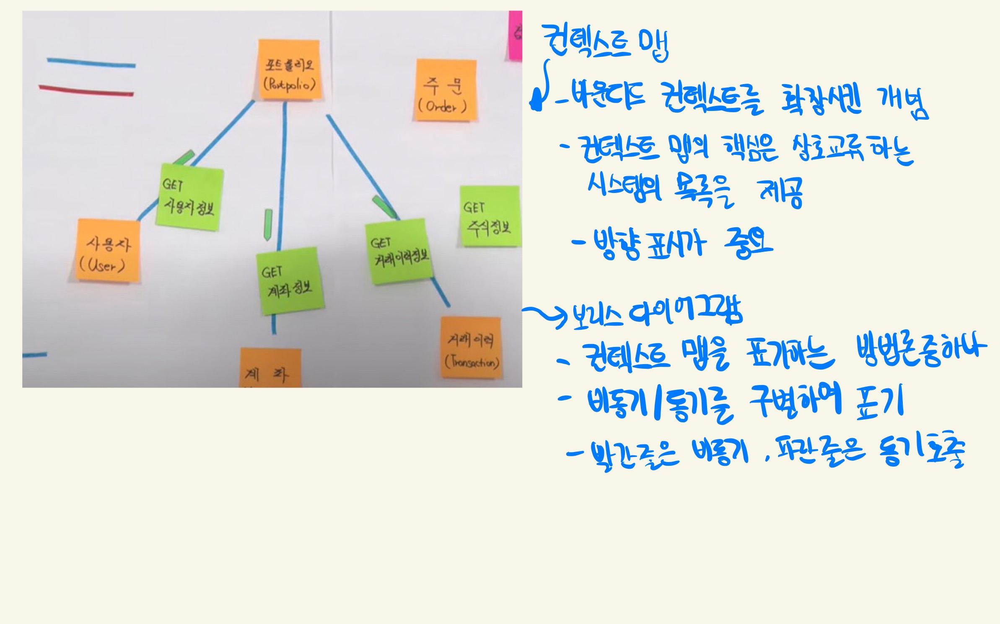

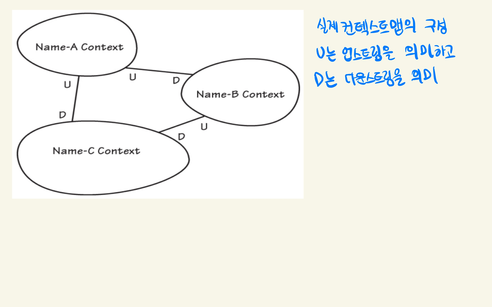

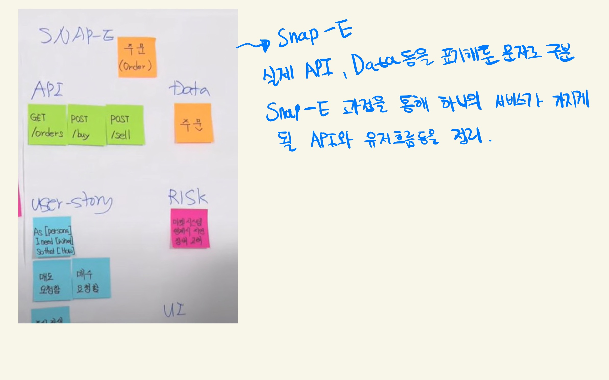

##### 이벤트 스토밍이외의 용어
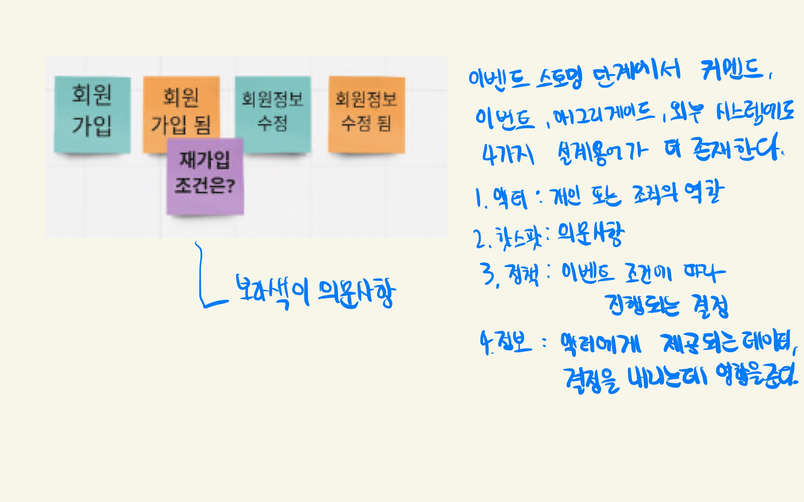

#### 1.3.5 Layered Archetecture
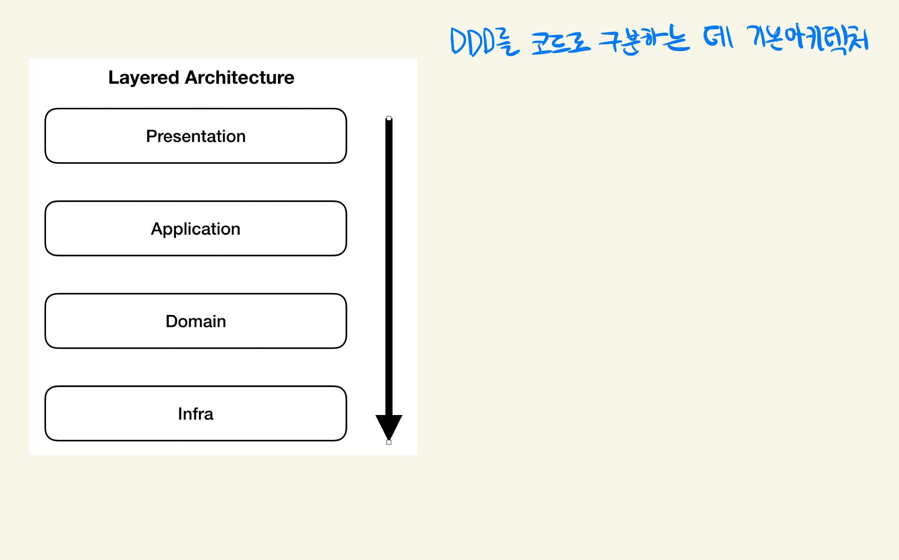

#### Presentation 표현계층
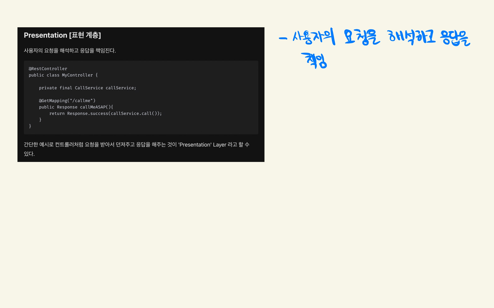

#### Applcation 응용계층
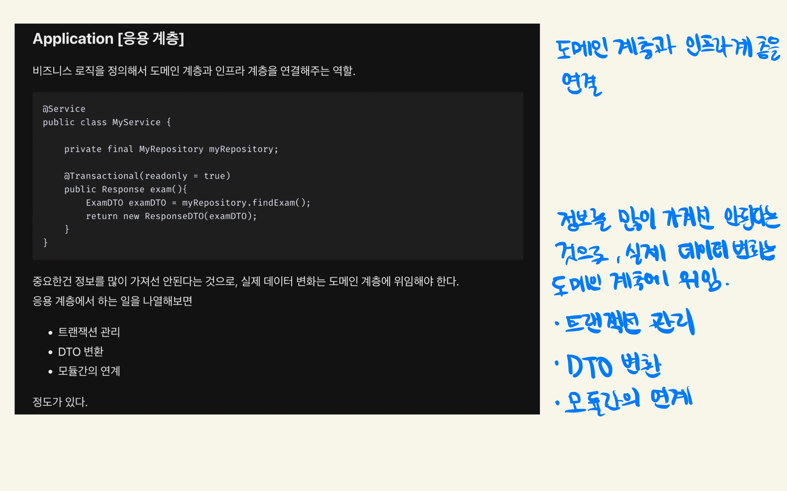

#### Domain 모델계층
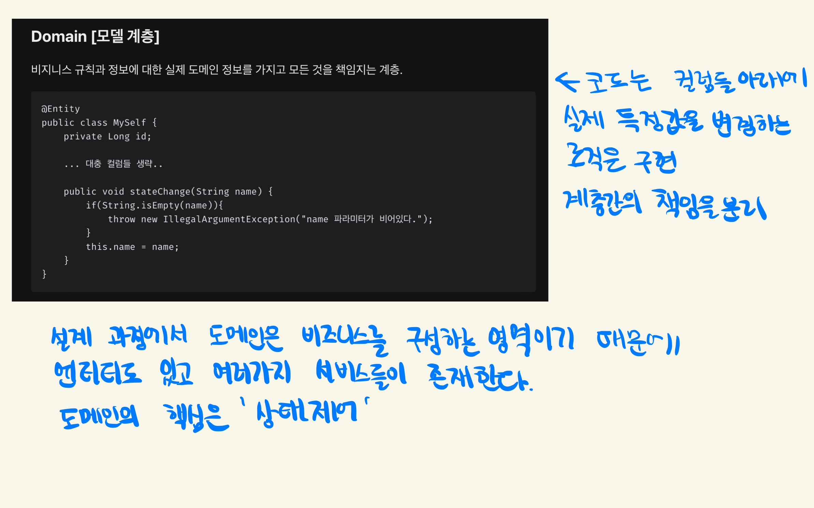

#### Infra 인프라계층
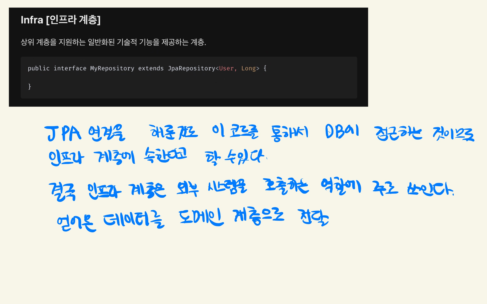

- 이 내용을 바탕으로 설계를 해서 코드로 구현하는 것이 목표

