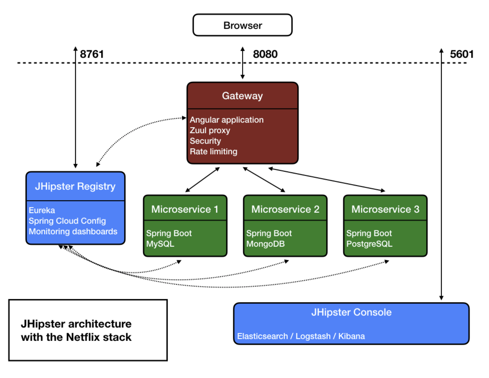
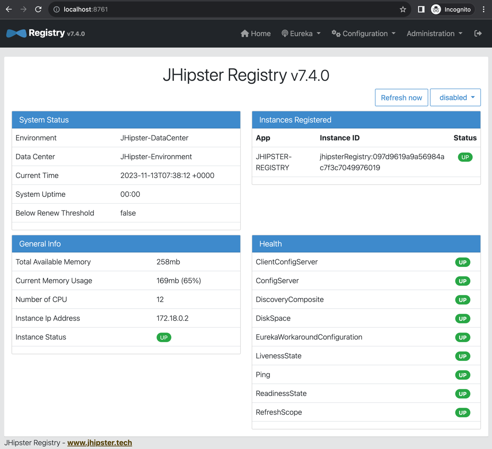
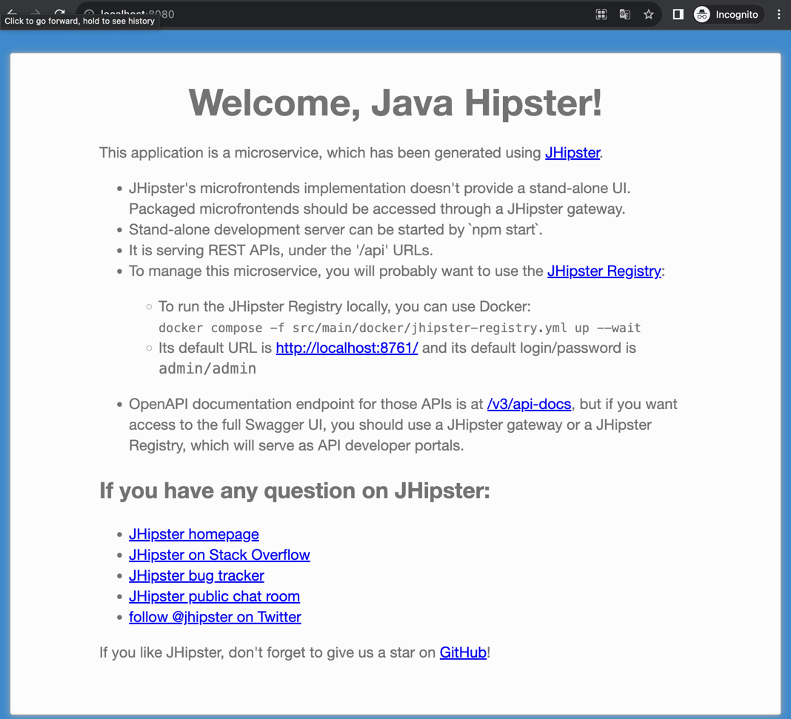
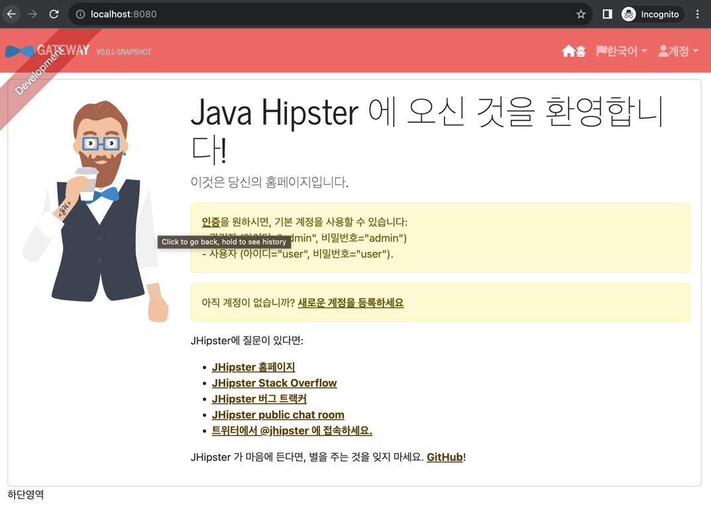

# 1. JHipster

## 1.1 JHipster?

```ssh
JHipster는 모던 웹 애플리케이션과 마이크로서비스 아키텍처를 빠르게 적용, 개발, 배포할 수 있도록 도와주는 오픈소스 개발 플랫폼
- Front-end : Angular, React, Vue,js
- Back-end  : Spring boot, Micronaut, Quarkus, Node.js, .NET
- Deploy    : Docker and Kubernetes for AWS, Azure, Cloud Foundary, GCP, Heroku, OpenShift
```

## 1.2 목적
```ssh
현대적인 웹 애플리케이션과 마이크로서비스 아키텍처를 생성하는데 있다.
- 광범위한 테스트를 커버할 수 있는 우수한 성능의 강력한 서버 스택
- 세련되고 현대적인 모바일 친화적 UI를 위한 Angular, React, Vue,js + BootStrap을 갖춘 CSS
- Webpack 및 Maven 또는 Gradle을 사용해 애플리케이션을 빌드하는 강력한 워크플로
- 클라우드에 빠르게 배포할 수 있는 코드 기반 인프라
```

## 1.3 JHipster 마이크로서비스 아키텍처

```ssh
- JHipster 레지스트리 : MSA 디스커버리 패턴의 구현, 다른 모든 요소를 서로 연결하고 서로 통신할 수 있게하는 역할을 한다. Eureka, Spring Cloud Config 기반으로 만들어진다.
- 마이크로서비스 : 백엔드 코드가 들어 있고, 실행 후 도메인에 대한 API를 노출한다. 여러 마이크로서비스로 구성될 수 있으며, 몇 개의 엔티티와 비즈니스 규칙이 포함된다.
- 게이트웨이 : 모든 Front-end 코드를 가지고 있으며, 전체 마이크로서비스에 생성한 API를 사용한다. Zuul Proxy, 리본을 사용한다.
- Back-end 소스코드 : src/main/java 폴더에 존재한다.
- Front-end 소스코드 : src/main/webapp 폴더에 존재하고, 앞에 선택한 기술로 만들어진다.
```

## 1.4 JHipster 환경 구축

- 현재 Mac OS를 사용 중이기 때문에 brew로 install
```ssh
$ brew install jhipster

$ jhipster
(node:44439) [DEP0040] DeprecationWarning: The `punycode` module is deprecated. Please use a userland alternative instead.
(Use `node --trace-deprecation ...` to show where the warning was created)

        ██╗ ██╗   ██╗ ████████╗ ███████╗   ██████╗ ████████╗ ████████╗ ███████╗
        ██║ ██║   ██║ ╚══██╔══╝ ██╔═══██╗ ██╔════╝ ╚══██╔══╝ ██╔═════╝ ██╔═══██╗
        ██║ ████████║    ██║    ███████╔╝ ╚█████╗     ██║    ██████╗   ███████╔╝
  ██╗   ██║ ██╔═══██║    ██║    ██╔════╝   ╚═══██╗    ██║    ██╔═══╝   ██╔══██║
  ╚██████╔╝ ██║   ██║ ████████╗ ██║       ██████╔╝    ██║    ████████╗ ██║  ╚██╗
   ╚═════╝  ╚═╝   ╚═╝ ╚═══════╝ ╚═╝       ╚═════╝     ╚═╝    ╚═══════╝ ╚═╝   ╚═╝
                            https://www.jhipster.tech
Welcome to JHipster v8.0.0

 _______________________________________________________________________________________________________________

  Documentation for creating an application is at https://www.jhipster.tech/creating-an-app/

  Application files will be generated in folder: /Users/daesoo/git/gateway
 _______________________________________________________________________________________________________________

WARNING! Your Node version is not LTS (Long Term Support), use it at your own risk! JHipster does not support non-LTS releases, so if you encounter a bug, please use a LTS version first.
? What is the base name of your application? gateway
? Which *type* of application would you like to create? Gateway application
? Besides Junit, which testing frameworks would you like to use?
? As you are running in a microservice architecture, on which port would like your server to run? It should be unique to avoid port conflicts. 8080
? What is your default Java package name? com.daesoo.gateway
? Which service discovery server do you want to use? JHipster Registry (legacy, uses Eureka, provides Spring Cloud Config support)
? Which *type* of authentication would you like to use? JWT authentication (stateless, with a token)
? Which *type* of database would you like to use? SQL (H2, PostgreSQL, MySQL, MariaDB, Oracle, MSSQL)
? Which *production* database would you like to use? PostgreSQL
? Which *development* database would you like to use? PostgreSQL
? Which cache do you want to use? (Spring cache abstraction) Hazelcast (distributed cache, for multiple nodes, supports rate-limiting for gateway
applications)
? Do you want to use Hibernate 2nd level cache? Yes
? Would you like to use Maven or Gradle for building the backend? Gradle
? Which other technologies would you like to use?
WARNING! Non reactive gateway is not supported. Switching to reactive.
? Which *Framework* would you like to use for the client? React
? Do you want to enable *microfrontends*? Yes
? Comma separated *microfrontend* app names. gatewayapp
? Besides Jest/Vitest, which testing frameworks would you like to use?
? Do you want to generate the admin UI? Yes
? Would you like to use a Bootswatch theme (https://bootswatch.com/)? Journal
? Choose a Bootswatch variant navbar theme (https://bootswatch.com/)? Primary
? Would you like to enable internationalization support? Yes
? Please choose the native language of the application Korean
? Please choose additional languages to install English
```

### 1.4.1 Registry & GateWay 실행
```ssh
$ docker-compose -f src/main/docker/jhipster-registry.yml up -d
```


```ssh
$ ./gradlew -x webapp
Downloading https://services.gradle.org/distributions/gradle-8.4-bin.zip
............10%............20%.............30%............40%.............50%............60%.............70%............80%.............90%............100%

Welcome to Gradle 8.4!

Here are the highlights of this release:
 - Compiling and testing with Java 21
 - Faster Java compilation on Windows
 - Role focused dependency configurations creation

For more details see https://docs.gradle.org/8.4/release-notes.html

Starting a Gradle Daemon (subsequent builds will be faster)

FAILURE: Build failed with an exception.

* What went wrong:
A problem occurred configuring root project 'gateway'.
> Could not resolve all files for configuration ':classpath'.
   > Could not resolve org.springframework.boot:spring-boot-gradle-plugin:3.1.5.
     Required by:
         project : > org.springframework.boot:org.springframework.boot.gradle.plugin:3.1.5
      > No matching variant of org.springframework.boot:spring-boot-gradle-plugin:3.1.5 was found. The consumer was configured to find a library for use during runtime, compatible with Java 11, packaged as a jar, and its dependencies declared externally, as well as attribute 'org.gradle.plugin.api-version' with value '8.4' but:
          - Variant 'apiElements' capability org.springframework.boot:spring-boot-gradle-plugin:3.1.5 declares a library, packaged as a jar, and its dependencies declared externally:
              - Incompatible because this component declares a component for use during compile-time, compatible with Java 17 and the consumer needed a component for use during runtime, compatible with Java 11
              - Other compatible attribute:
                  - Doesn't say anything about org.gradle.plugin.api-version (required '8.4')
          - Variant 'javadocElements' capability org.springframework.boot:spring-boot-gradle-plugin:3.1.5 declares a component for use during runtime, and its dependencies declared externally:
              - Incompatible because this component declares documentation and the consumer needed a library
              - Other compatible attributes:
                  - Doesn't say anything about its target Java version (required compatibility with Java 11)
                  - Doesn't say anything about its elements (required them packaged as a jar)
                  - Doesn't say anything about org.gradle.plugin.api-version (required '8.4')
          - Variant 'mavenOptionalApiElements' capability org.springframework.boot:spring-boot-gradle-plugin-maven-optional:3.1.5 declares a library, packaged as a jar, and its dependencies declared externally:
              - Incompatible because this component declares a component for use during compile-time, compatible with Java 17 and the consumer needed a component for use during runtime, compatible with Java 11
              - Other compatible attribute:
                  - Doesn't say anything about org.gradle.plugin.api-version (required '8.4')
          - Variant 'mavenOptionalRuntimeElements' capability org.springframework.boot:spring-boot-gradle-plugin-maven-optional:3.1.5 declares a library for use during runtime, packaged as a jar, and its dependencies declared externally:
              - Incompatible because this component declares a component, compatible with Java 17 and the consumer needed a component, compatible with Java 11
              - Other compatible attribute:
                  - Doesn't say anything about org.gradle.plugin.api-version (required '8.4')
          - Variant 'runtimeElements' capability org.springframework.boot:spring-boot-gradle-plugin:3.1.5 declares a library for use during runtime, packaged as a jar, and its dependencies declared externally:
              - Incompatible because this component declares a component, compatible with Java 17 and the consumer needed a component, compatible with Java 11
              - Other compatible attribute:
                  - Doesn't say anything about org.gradle.plugin.api-version (required '8.4')
          - Variant 'sourcesElements' capability org.springframework.boot:spring-boot-gradle-plugin:3.1.5 declares a component for use during runtime, and its dependencies declared externally:
              - Incompatible because this component declares documentation and the consumer needed a library
              - Other compatible attributes:
                  - Doesn't say anything about its target Java version (required compatibility with Java 11)
                  - Doesn't say anything about its elements (required them packaged as a jar)
                  - Doesn't say anything about org.gradle.plugin.api-version (required '8.4')

* Try:
> Run with --stacktrace option to get the stack trace.
> Run with --info or --debug option to get more log output.
> Run with --scan to get full insights.
> Get more help at https://help.gradle.org.

BUILD FAILED in 1m 1s

책이 예전에 나온 부분이라 여기선 Spring boot 3 버전을 사용하고 있는 것 같다. 설치되어 있는 현재 자바버전은 11이기 때문에 17로 올려준다.
$ brew tap homebrew/cask-versions
$ brew info temurin17
$ brew install temurin17
$ java -version
openjdk version "17.0.9" 2023-10-17
OpenJDK Runtime Environment Temurin-17.0.9+9 (build 17.0.9+9)
OpenJDK 64-Bit Server VM Temurin-17.0.9+9 (build 17.0.9+9, mixed mode)


$ docker-compose -f src/main/docker/postgresql.yml up -d
$ ./gradlew -Dsonar.gradle.skipCompile=true --warning-mode all
```


- 책과 화면이 다른대 제대로 된 건지 모르겠다.
- 그래서 기존에 microservice 에서 gateway로 변경 -> ? Which *type* of application would you like to create? Gateway application



- 해결(어이없게 삽질 ㅠ)
- 위의 선택 항목 변경을 해놔서 바로 적용이 가능
```ssh
<============-> 92% EXECUTING [2m 38s]
> IDLE
> IDLEtRun
> IDLE
> IDLE
> IDLE
> IDLE
> IDLE
> IDLE
> IDLE
> IDLE
> :bootRun
> IDLE
여기서 안넘어가는 이유를 모르겠음
```

아래는 도커 내릴 경우
```ssh
$ docker-compose -f src/main/docker/postgresql.yml down -v
$ docker-compose -f src/main/docker/jhipster-registry.yml down -v
```