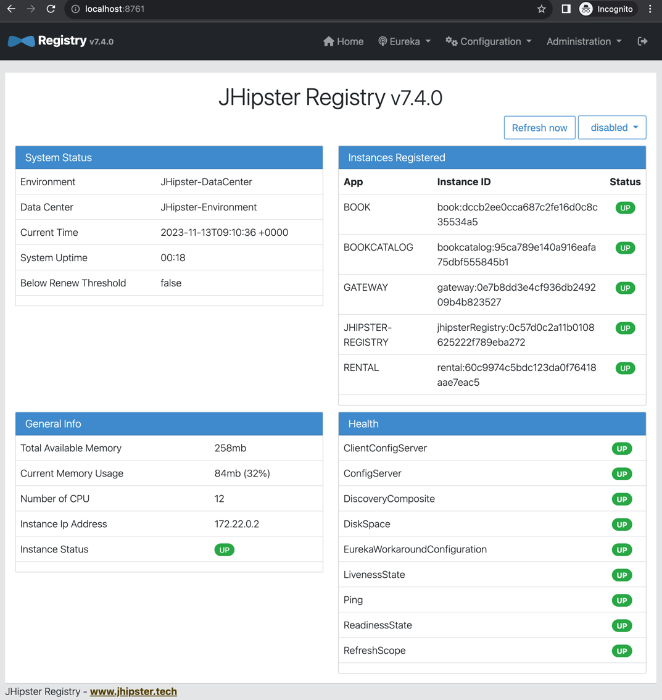

# 2. Microservice Service Create

## 2.1 Book Service Create
```ssh
$ mkdir ddd-book
$ cd ddd-book
$ jhipster
(node:56896) [DEP0040] DeprecationWarning: The `punycode` module is deprecated. Please use a userland alternative instead.
(Use `node --trace-deprecation ...` to show where the warning was created)

        ██╗ ██╗   ██╗ ████████╗ ███████╗   ██████╗ ████████╗ ████████╗ ███████╗
        ██║ ██║   ██║ ╚══██╔══╝ ██╔═══██╗ ██╔════╝ ╚══██╔══╝ ██╔═════╝ ██╔═══██╗
        ██║ ████████║    ██║    ███████╔╝ ╚█████╗     ██║    ██████╗   ███████╔╝
  ██╗   ██║ ██╔═══██║    ██║    ██╔════╝   ╚═══██╗    ██║    ██╔═══╝   ██╔══██║
  ╚██████╔╝ ██║   ██║ ████████╗ ██║       ██████╔╝    ██║    ████████╗ ██║  ╚██╗
   ╚═════╝  ╚═╝   ╚═╝ ╚═══════╝ ╚═╝       ╚═════╝     ╚═╝    ╚═══════╝ ╚═╝   ╚═╝
                            https://www.jhipster.tech
Welcome to JHipster v8.0.0

 _______________________________________________________________________________________________________________

  Documentation for creating an application is at https://www.jhipster.tech/creating-an-app/

  Application files will be generated in folder: /Users/daesoo/git/ddd-book
 _______________________________________________________________________________________________________________

WARNING! Your Node version is not LTS (Long Term Support), use it at your own risk! JHipster does not support non-LTS releases, so if you encounter a bug, please use a LTS version first.
? What is the base name of your application? book
? Which *type* of application would you like to create? Microservice application
? Besides Junit, which testing frameworks would you like to use?
? Do you want to make it reactive with Spring WebFlux? No
? As you are running in a microservice architecture, on which port would like your server to run? It should be unique to avoid port conflicts. 8081
? What is your default Java package name? com.daesoo.book
? Which service discovery server do you want to use? JHipster Registry (legacy, uses Eureka, provides Spring Cloud Config support)
? Which *type* of authentication would you like to use? JWT authentication (stateless, with a token)
? Which *type* of database would you like to use? SQL (H2, PostgreSQL, MySQL, MariaDB, Oracle, MSSQL)
? Which *production* database would you like to use? PostgreSQL
? Which *development* database would you like to use? H2 with in-memory persistence
? Which cache do you want to use? (Spring cache abstraction) Hazelcast (distributed cache, for multiple nodes, supports rate-limiting for gateway
applications)
? Do you want to use Hibernate 2nd level cache? Yes
? Would you like to use Maven or Gradle for building the backend? Gradle
? Which other technologies would you like to use?
? Which *Framework* would you like to use as microfrontend? No client
? Would you like to enable internationalization support? Yes
? Please choose the native language of the application Korean
? Please choose additional languages to install English 
```

## 2.2 Book Catalog Service Create
```ssh
$ mkdir ddd-book-catalog
$ cd ddd-book-catalog
$ jhipster
(node:57817) [DEP0040] DeprecationWarning: The `punycode` module is deprecated. Please use a userland alternative instead.
(Use `node --trace-deprecation ...` to show where the warning was created)

        ██╗ ██╗   ██╗ ████████╗ ███████╗   ██████╗ ████████╗ ████████╗ ███████╗
        ██║ ██║   ██║ ╚══██╔══╝ ██╔═══██╗ ██╔════╝ ╚══██╔══╝ ██╔═════╝ ██╔═══██╗
        ██║ ████████║    ██║    ███████╔╝ ╚█████╗     ██║    ██████╗   ███████╔╝
  ██╗   ██║ ██╔═══██║    ██║    ██╔════╝   ╚═══██╗    ██║    ██╔═══╝   ██╔══██║
  ╚██████╔╝ ██║   ██║ ████████╗ ██║       ██████╔╝    ██║    ████████╗ ██║  ╚██╗
   ╚═════╝  ╚═╝   ╚═╝ ╚═══════╝ ╚═╝       ╚═════╝     ╚═╝    ╚═══════╝ ╚═╝   ╚═╝
                            https://www.jhipster.tech
Welcome to JHipster v8.0.0

 _______________________________________________________________________________________________________________

  Documentation for creating an application is at https://www.jhipster.tech/creating-an-app/

  Application files will be generated in folder: /Users/daesoo/git/ddd-book-catalog
 _______________________________________________________________________________________________________________

WARNING! Your Node version is not LTS (Long Term Support), use it at your own risk! JHipster does not support non-LTS releases, so if you encounter a bug, please use a LTS version first.
? What is the base name of your application? bookCatalog
? Which *type* of application would you like to create? Microservice application
? Besides Junit, which testing frameworks would you like to use? Cucumber
? Do you want to make it reactive with Spring WebFlux? No
? As you are running in a microservice architecture, on which port would like your server to run? It should be unique to avoid port conflicts. 8082
? What is your default Java package name? com.daesoo.bookcatalog
? Which service discovery server do you want to use? JHipster Registry (legacy, uses Eureka, provides Spring Cloud Config support)
? Which *type* of authentication would you like to use? JWT authentication (stateless, with a token)
? Which *type* of database would you like to use? SQL (H2, PostgreSQL, MySQL, MariaDB, Oracle, MSSQL)
? Which *production* database would you like to use? PostgreSQL
? Which *development* database would you like to use? H2 with in-memory persistence
? Which cache do you want to use? (Spring cache abstraction) Hazelcast (distributed cache, for multiple nodes, supports rate-limiting for gateway
applications)
? Do you want to use Hibernate 2nd level cache? Yes
? Would you like to use Maven or Gradle for building the backend? Gradle
? Which other technologies would you like to use?
? Which *Framework* would you like to use as microfrontend? No client
? Would you like to enable internationalization support? Yes
? Please choose the native language of the application Korean
? Please choose additional languages to install English
```
## 2.3 Rental Service Create
```ssh
$ mkdir ddd-rental
$ cd ddd-rental
$ jhipster
(node:59687) [DEP0040] DeprecationWarning: The `punycode` module is deprecated. Please use a userland alternative instead.
(Use `node --trace-deprecation ...` to show where the warning was created)

        ██╗ ██╗   ██╗ ████████╗ ███████╗   ██████╗ ████████╗ ████████╗ ███████╗
        ██║ ██║   ██║ ╚══██╔══╝ ██╔═══██╗ ██╔════╝ ╚══██╔══╝ ██╔═════╝ ██╔═══██╗
        ██║ ████████║    ██║    ███████╔╝ ╚█████╗     ██║    ██████╗   ███████╔╝
  ██╗   ██║ ██╔═══██║    ██║    ██╔════╝   ╚═══██╗    ██║    ██╔═══╝   ██╔══██║
  ╚██████╔╝ ██║   ██║ ████████╗ ██║       ██████╔╝    ██║    ████████╗ ██║  ╚██╗
   ╚═════╝  ╚═╝   ╚═╝ ╚═══════╝ ╚═╝       ╚═════╝     ╚═╝    ╚═══════╝ ╚═╝   ╚═╝
                            https://www.jhipster.tech
Welcome to JHipster v8.0.0

 _______________________________________________________________________________________________________________

  Documentation for creating an application is at https://www.jhipster.tech/creating-an-app/

  Application files will be generated in folder: /Users/daesoo/git/ddd-rental
 _______________________________________________________________________________________________________________

WARNING! Your Node version is not LTS (Long Term Support), use it at your own risk! JHipster does not support non-LTS releases, so if you encounter a bug, please use a LTS version first.
? What is the base name of your application? rental
? Which *type* of application would you like to create? Microservice application
? Besides Junit, which testing frameworks would you like to use? Cucumber
? Do you want to make it reactive with Spring WebFlux? No
? As you are running in a microservice architecture, on which port would like your server to run? It should be unique to avoid port conflicts. 8083
? What is your default Java package name? com.daesoo.rental
? Which service discovery server do you want to use? JHipster Registry (legacy, uses Eureka, provides Spring Cloud Config support)
? Which *type* of authentication would you like to use? JWT authentication (stateless, with a token)
? Which *type* of database would you like to use? SQL (H2, PostgreSQL, MySQL, MariaDB, Oracle, MSSQL)
? Which *production* database would you like to use? PostgreSQL
? Which *development* database would you like to use? H2 with in-memory persistence
? Which cache do you want to use? (Spring cache abstraction) Hazelcast (distributed cache, for multiple nodes, supports rate-limiting for gateway
applications)
? Do you want to use Hibernate 2nd level cache? Yes
? Would you like to use Maven or Gradle for building the backend? Gradle
? Which other technologies would you like to use?
? Which *Framework* would you like to use as microfrontend? No client
? Would you like to enable internationalization support? Yes
? Please choose the native language of the application Korean
? Please choose additional languages to install English
```
## 2.4 빌드 성공시
